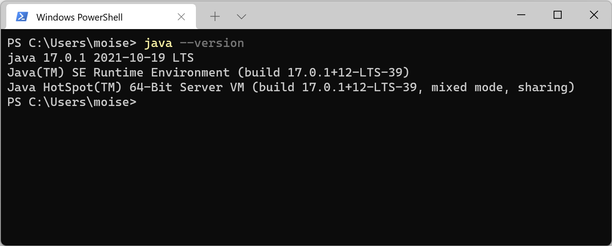
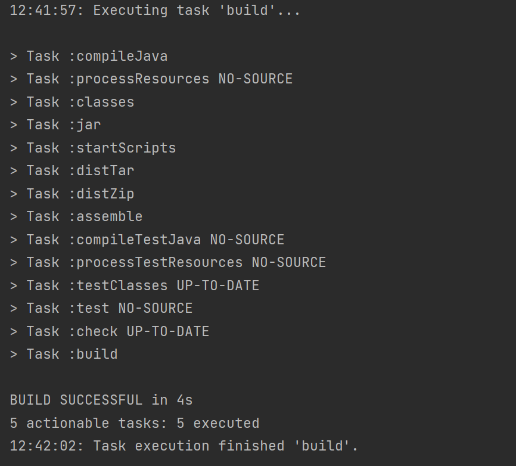
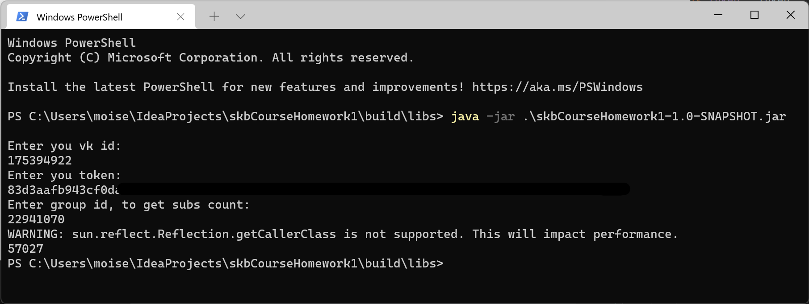

# java_skbCourse_hw12
## JRE И JDK

## Gradle
#### Содержимое файла ```build.gradle```
```
plugins {
    id 'application'
}

group 'org.example'
version '1.0-SNAPSHOT'

repositories {
    mavenCentral()
}

dependencies {
    implementation 'com.vk.api:sdk:1.0.14'
    implementation 'org.json:json:20211205'
}

test {
    useJUnitPlatform()
}

mainClassName = "Main"

jar {
    manifest {
        attributes 'Main-Class': 'Main'
        exclude 'LICENSE.txt'
        exclude 'NOTICE.txt'
        exclude 'META-INF/INDEX.LIST'
        exclude 'META-INF/LICENSE'
        exclude 'META-INF/LICENSE.txt'
        exclude 'META-INF/DEPENDENCIES'
        exclude 'META-INF/NOTICE'
        exclude 'META-INF/NOTICE.txt'
        exclude 'META-INF/maven/**'
        exclude 'META-INF/io.netty.versions.properties'
    }
    from {
        configurations.runtimeClasspath.collect { it.isDirectory() ? it : zipTree(it) }
    }

}
```
#### Результат сборки


#### Работа приложения

> WARNING - скорее всего из-за бага/проблемы в java vk sdk
